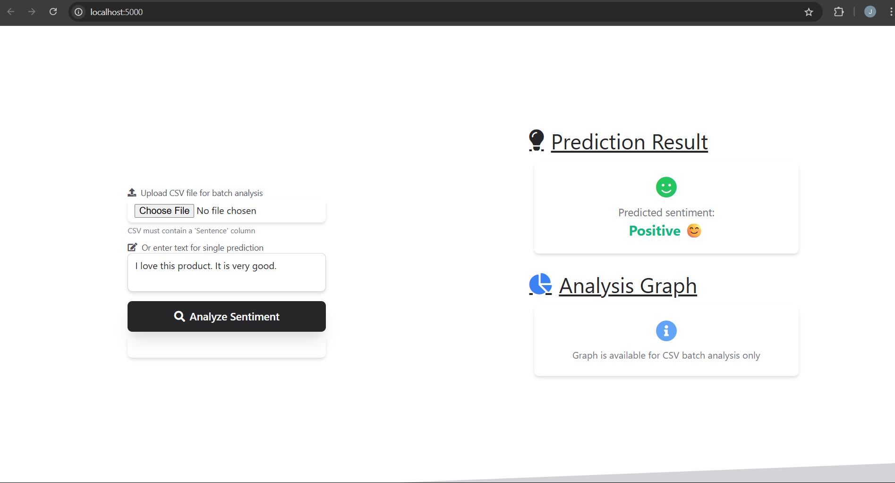
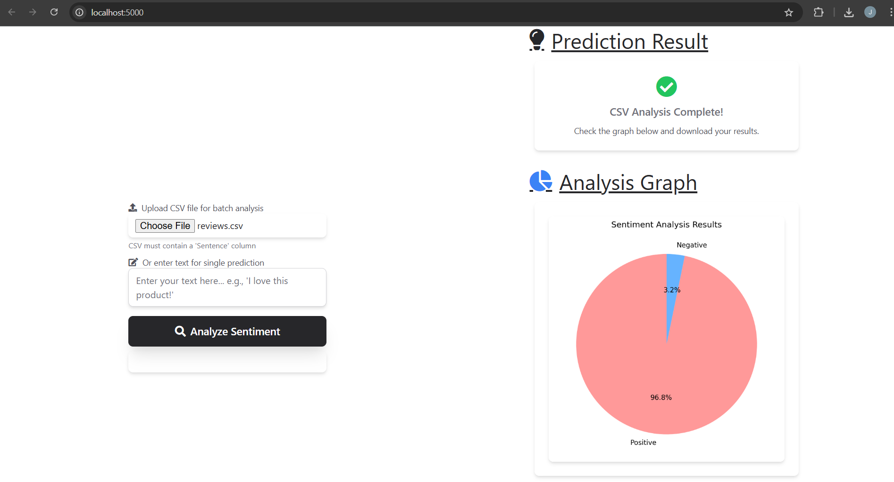

# 🎭 Sentiment Analysis on Amazon Reviews


A comprehensive sentiment analysis application that predicts whether text reviews are positive or negative. Built with machine learning models trained on Amazon Alexa reviews dataset and deployed as a user-friendly web application using Flask.

## 🌟 Features

### 🤖 Machine Learning
- **Multiple ML Models**: Random Forest, XGBoost, and Decision Tree classifiers
- **Advanced Text Processing**: NLTK-based preprocessing with stemming and stopword removal
- **High Accuracy**: Achieved 90%+ accuracy on test data
- **Feature Engineering**: Count vectorization with 2500 max features

### 🌐 Web Application
- **Beautiful UI**: Modern, responsive design with Tailwind CSS
- **Dual Input Methods**: 
  - Single text prediction for instant analysis
  - CSV batch processing for bulk analysis
- **Visual Analytics**: Interactive pie charts showing sentiment distribution
- **Export Functionality**: Download results as CSV files
- **Real-time Feedback**: Loading states and error handling

### 📊 Analytics
- **Sentiment Distribution Charts**: Visual representation of analysis results
- **Batch Processing**: Handle multiple reviews simultaneously
- **Performance Metrics**: Confusion matrices and accuracy scores
- **Cross-validation**: K-fold validation for model robustness

## 🏗️ Project Structure

```
sentiment-analysis-project/
├── 📁 Models/                          # Trained model files
│   ├── model_xgb.pkl                   # XGBoost classifier
│   ├── model_rf.pkl                    # Random Forest classifier
│   ├── scaler.pkl                      # MinMax scaler
│   └── countVectorizer.pkl             # Count vectorizer
├── 📁 templates/                       # HTML templates
│   └── landing.html                    # Main web interface
├── 📁 data/                           # Dataset
│   └── amazon_alexa.tsv               # Amazon Alexa reviews dataset
├── 📁 screenshots/                     # Application screenshots (optional)
│   ├── homepage.png
│   ├── single_prediction.png
│   ├── batch_analysis.png
│   └── results_chart.png
├── 📄 sentiment_analysis_on_amazon_reviews.py  # Model training script
├── 📄 api.py                          # Flask web application
├── 📄 requirements.txt                # Python dependencies
├── 📄 test_api.py                     # API testing script (optional)
└── 📄 README.md                       # Project documentation
```

## 🚀 Quick Start

### Prerequisites
- Python 3.7 or higher
- pip (Python package installer)

### 1. Clone the Repository
```bash
git clone https://github.com/jeevankumar54/Sentiment_Analysis_on_Amazon_Reviews.git
cd sentiment-analysis-project
```

### 2. Create Virtual Environment (Recommended)
```bash
# Create virtual environment
python -m venv sentiment_env

# Activate virtual environment
# On Windows:
sentiment_env\Scripts\activate
# On macOS/Linux:
source sentiment_env/bin/activate
```

### 3. Install Dependencies
```bash
pip install -r requirements.txt
```

### 4. Download NLTK Data
```python
python -c "import nltk; nltk.download('stopwords')"
```

### 5. Train the Models
```bash
python sentiment_analysis_on_amazon_reviews.py
```
This will create the model files in the `Models/` directory.

### 6. Run the Application
```bash
python api.py
```

### 7. Access the Application
Open your web browser and navigate to: `http://localhost:5000`

## 📖 Usage Guide

### Single Text Prediction
1. Enter your text in the text area
2. Click "Analyze Sentiment"
3. View the prediction result (Positive/Negative)


*Example: Single text sentiment prediction*

### Batch CSV Analysis
1. Prepare a CSV file with a 'Sentence' column
2. Upload the file using the file picker
3. Click "Analyze Sentiment"
4. View the sentiment distribution chart
5. Download the results CSV with predictions


*Example: CSV batch processing with visual analytics*

### CSV Format
Your CSV file should have this structure:
```csv
Sentence
"I love this product! Amazing quality."
"Terrible customer service. Very disappointed."
"Great value for money. Highly recommend."
"Product broke after one day of use."
```

## 🔬 Technical Details

### Dataset
- **Source**: Amazon Alexa Reviews
- **Size**: 3,150 reviews
- **Features**: Review text, ratings, feedback, product variation
- **Target**: Binary sentiment (Positive=1, Negative=0)

### Data Preprocessing
1. **Text Cleaning**: Remove non-alphabetic characters
2. **Normalization**: Convert to lowercase
3. **Tokenization**: Split into individual words
4. **Stopword Removal**: Remove common English stopwords
5. **Stemming**: Reduce words to their root form using Porter Stemmer
6. **Vectorization**: Convert text to numerical features using Count Vectorizer

### Model Performance

| Model | Training Accuracy | Test Accuracy | Cross-Validation |
|-------|------------------|---------------|------------------|
| Random Forest | 99.2% | 91.8% | 91.2% ± 2.1% |
| XGBoost | 98.7% | 92.3% | 91.8% ± 1.9% |
| Decision Tree | 99.9% | 89.5% | 89.1% ± 3.2% |

### Key Libraries
- **Flask**: Web framework for the application
- **Scikit-learn**: Machine learning algorithms and preprocessing
- **XGBoost**: Gradient boosting classifier
- **NLTK**: Natural language processing
- **Pandas**: Data manipulation and analysis
- **Matplotlib**: Data visualization
- **NumPy**: Numerical computing

## 🎯 API Endpoints

### `GET /`
- **Description**: Home page with web interface
- **Response**: HTML page

### `POST /predict`
- **Description**: Predict sentiment for text or CSV file
- **Input**: 
  - JSON: `{"text": "Your text here"}`
  - File: CSV with 'Sentence' column
- **Response**: 
  - JSON: `{"result": "Positive/Negative"}`
  - File: CSV with predictions + chart data

### `GET /health`
- **Description**: Health check endpoint
- **Response**: `{"status": "healthy", "models_loaded": true}`

### Example API Usage

#### Single Text Prediction
```bash
curl -X POST http://localhost:5000/predict \
  -H "Content-Type: application/json" \
  -d '{"text": "I love this product!"}'
```

#### CSV File Upload
```bash
curl -X POST http://localhost:5000/predict \
  -F "file=@your_reviews.csv"
```

## 🧪 Testing

### Run the Test Suite
```bash
python test_api.py
```

### Manual Testing
1. **Health Check**: Visit `http://localhost:5000/health`
2. **Single Prediction**: Enter text on the homepage
3. **Batch Processing**: Upload a test CSV file

### Test CSV Creation
Create a test file `test_reviews.csv`:
```csv
Sentence
"Excellent product quality"
"Poor customer service"
"Love the fast delivery"
"Product arrived damaged"
"Highly recommend this item"
```

## 🔧 Configuration

### Environment Variables
Create a `.env` file for configuration:
```bash
FLASK_ENV=production
DEBUG=False
MODEL_PATH=Models/
MAX_CONTENT_LENGTH=16777216  # 16MB file upload limit
```

### Model Parameters
Edit `sentiment_analysis_on_amazon_reviews.py` to adjust:
- **Max Features**: `CountVectorizer(max_features=2500)`
- **Test Size**: `train_test_split(test_size=0.2)`
- **Cross-validation Folds**: `cross_val_score(cv=10)`

## 📈 Model Training Details

### Data Exploration
- **Rating Distribution**: 5-star (66%), 4-star (15%), 3-star (8%), 2-star (5%), 1-star (6%)
- **Feedback Distribution**: Positive (91.7%), Negative (8.3%)
- **Product Variations**: Multiple Alexa device types analyzed

### Feature Engineering
- **Text Length**: Added review length as a feature
- **Word Cloud**: Generated for exploratory data analysis
- **Count Vectorization**: 2500 most frequent words
- **Scaling**: MinMax scaling for numerical features

### Model Selection
1. **Baseline**: Logistic Regression
2. **Ensemble**: Random Forest with 100 estimators
3. **Boosting**: XGBoost with default parameters
4. **Tree**: Decision Tree for interpretability

### Hyperparameter Tuning
```python
# Random Forest Grid Search
params = {
    'bootstrap': [True],
    'max_depth': [80, 100],
    'min_samples_split': [8, 12],
    'n_estimators': [100, 300]
}
```

## 🚀 Deployment

### Local Development
```bash
python api.py
```

## 🤝 Contributing

1. Fork the repository
2. Create a feature branch (`git checkout -b feature/AmazingFeature`)
3. Commit your changes (`git commit -m 'Add some AmazingFeature'`)
4. Push to the branch (`git push origin feature/AmazingFeature`)
5. Open a Pull Request

### Development Setup
```bash
# Install development dependencies
pip install -r requirements-dev.txt

# Run tests
python -m pytest tests/

# Format code
black sentiment_analysis_on_amazon_reviews.py api.py

# Lint code
flake8 *.py
```

## 📊 Performance Optimization

### Model Optimization
- **Feature Selection**: Use TF-IDF instead of Count Vectorizer for better performance
- **Dimensionality Reduction**: Apply PCA for high-dimensional data
- **Ensemble Methods**: Combine multiple models using voting classifiers

### Web App Optimization
- **Caching**: Implement Redis for model caching
- **Async Processing**: Use Celery for background tasks
- **Load Balancing**: Deploy multiple instances with Nginx

## 🐛 Troubleshooting

### Common Issues

#### XGBoost Module Not Found
```bash
pip install xgboost
```

#### NLTK Data Missing
```python
import nltk
nltk.download('stopwords')
```

#### Model Files Missing
```bash
python sentiment_analysis_on_amazon_reviews.py
```

#### Port Already in Use
```bash
# Change port in api.py
app.run(host='0.0.0.0', port=5001, debug=True)
```

#### Memory Issues
- Reduce `max_features` in CountVectorizer
- Use smaller batch sizes for CSV processing
- Implement data streaming for large files

## 🔮 Future Enhancements

- [ ] **Deep Learning Models**: Implement LSTM/BERT for better accuracy
- [ ] **Real-time Processing**: Add WebSocket support for live predictions
- [ ] **Multi-language Support**: Extend to non-English text analysis
- [ ] **Sentiment Intensity**: Predict sentiment scores (0-1) instead of binary
- [ ] **Topic Modeling**: Add topic extraction alongside sentiment
- [ ] **User Authentication**: Add user accounts and prediction history
- [ ] **API Rate Limiting**: Implement request throttling
- [ ] **A/B Testing**: Compare different model versions
- [ ] **Mobile App**: Create React Native mobile application
- [ ] **Chrome Extension**: Browser extension for web page sentiment analysis

---

⭐ **Star this repository if you found it helpful!**